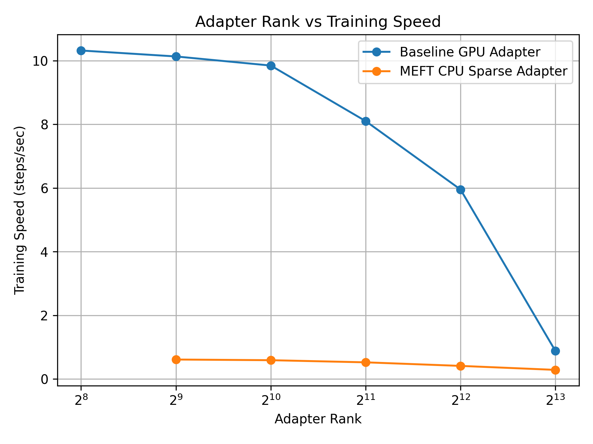
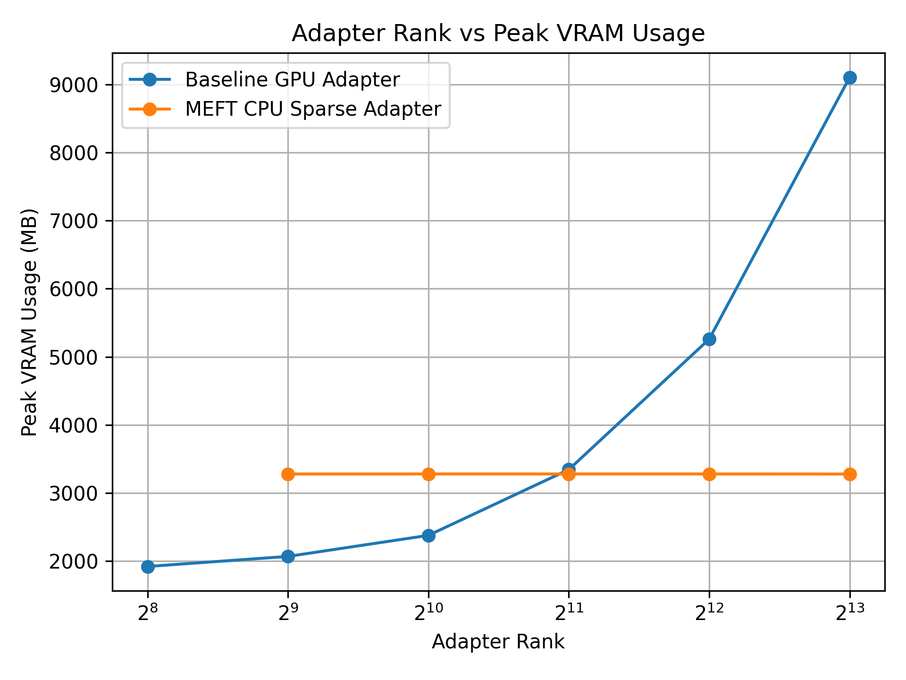

# MEFT-LLM-Adapters

## Overview

This project explores **memory-efficient fine-tuning of large language models (LLMs)** using adapter-based methods.

We implement and compare:

* **Baseline GPU Adapters** (standard dense adapters)
* **MEFT Sparse CPU Adapters** (Memory-Efficient Fine-Tuning)

The goal is to analyze the tradeoff between:

* **Training speed**
* **GPU memory (VRAM) usage**

as adapter rank increases.

---

## Motivation

Fine-tuning large language models is expensive in terms of GPU memory.
Even parameter-efficient methods like adapters can scale poorly as their rank increases.

This project investigates a simple idea:

> Can we offload most adapter computation to CPU and only activate a small subset of neurons dynamically?

---

## Key Idea: MEFT (Memory-Efficient Fine-Tuning)

The MEFT approach modifies standard adapters by:

* Storing adapter weights on **CPU**
* Computing **activation scores**
* Selecting only the **Top-K neurons**
* Moving only those to GPU for computation

This results in:

* **Near-constant VRAM usage**
* **Sparse computation**
* **Tradeoff: slower training speed**

---

## Architecture

### Baseline Adapter (Dense)

Each transformer MLP is replaced with:

```
Output = Frozen_MLP(h) + Adapter(h)
```

Where:

* Adapter = Linear → ReLU → Linear
* Runs fully on GPU

Example implementation:

```python
class ParallelAdapter(nn.Module):
    def __init__(self, d_model, rank):
        self.WA = nn.Linear(d_model, rank)
        self.WB = nn.Linear(rank, d_model)
```

---

### MEFT Adapter (Sparse CPU)

Key differences:

* Weights stored on CPU
* Only Top-K activations used per forward pass

```python
scores = h_cpu @ WA.T
topk_idx = torch.topk(scores, k).indices
```

Only selected weights are transferred to GPU dynamically.

---

## Experimental Setup

* Model: `gpt2-medium`
* Sequence length: 128
* Batch size: 1
* Training steps: 10
* Dataset: small synthetic QA-style dataset
* Device: CUDA-enabled GPU

---

## Results

### Training Speed vs Adapter Rank



### Peak VRAM Usage vs Adapter Rank



---

## Observations

### Baseline GPU Adapter

* Fast training
* VRAM usage grows significantly with rank
* Becomes impractical at high ranks

### MEFT Sparse CPU Adapter

* VRAM usage remains nearly constant
* Enables very large adapter ranks
* Slower due to CPU-GPU data movement

---

## Key Takeaways

* **Memory vs Speed tradeoff is clear**
* MEFT enables scaling adapter rank without increasing GPU memory
* Sparse activation is effective but introduces overhead
* Practical for memory-constrained environments

---

## Repository Structure

```
MEFT-LLM-Adapters/
│
├── baseline/              # Dense GPU adapter experiments
├── meft/                  # Sparse CPU adapter experiments
├── experiments/           # Plots and analysis
├── tests/                 # Injection and sanity tests
│
└── README.md
```

---

## How to Run

### 1. Install Dependencies

```bash
pip install torch transformers matplotlib
```

### 2. Run Baseline Adapter

```bash
python train_baseline.py
```

### 3. Run MEFT Adapter

```bash
python train_meft.py
```

### 4. Generate Plots

```bash
python plot_results.py
```

---

## Skills & Concepts Demonstrated

### Machine Learning

* Transformer architectures (GPT-2)
* Parameter-efficient fine-tuning (PEFT)
* Adapter-based learning

### Systems & Optimization

* CPU ↔ GPU memory tradeoffs
* Sparse computation (Top-K selection)
* Runtime vs memory optimization

### Engineering

* Model surgery / layer injection
* PyTorch module design
* Experiment tracking and visualization

---

## Future Work

* Optimize CPU-GPU transfer overhead
* Use batching for Top-K selection
* Extend to larger models (e.g., LLaMA)
* Compare with LoRA and other PEFT methods

---

## Author

George Elassal

---

## References
[1] Hao, J., Sun, W., Xin, X., Meng, Q., Chen, Z., Ren, P., & Ren, Z. (2024). MEFT: Memory-Efficient Fine-Tuning through Sparse Adapter. In Proceedings of ACL 2024 (pp. 2375–2388). 
[2] Ren, J., Rajbhandari, S., Aminabadi, R. Y., Ruwase, O., Yang, S., Zhang, M., Li, D., & He, Y. (2021). ZeRO-Offload: Democratizing Billion-Scale Model Training. USENIX ATC 2021. 
[3] Hu, E. J., Shen, Y., Wallis, P., Allen-Zhu, Z., Li, Y., Wang, S., Wang, L., & Chen, W. (2022). LoRA: Low-Rank Adaptation of Large Language Models. ICLR 2022. 
[4] He, J., Zhou, C., Ma, X., Berg-Kirkpatrick, T., & Neubig, G. (2022). Towards a Unified View of Parameter-Efficient Transfer Learning. ICLR 2022. [Parallel Adapter] 
[5] Touvron, H., et al. (2023). LLaMA: Open and Efficient Foundation Language Models. arXiv:2302.13971. 
[6] Kwiatkowski, T., et al. (2019). Natural Questions: A Benchmark for Question Answering Research. TACL. 
[7] Zeng, C., Liu, S., Yang, S., Chen, F., Mei, X., & Fu, L. (2025). GQSA: Group Quantization and Sparsity for Accelerating Large Language Model Inference. IJCNLP 2025. [Referenced for future work] 


